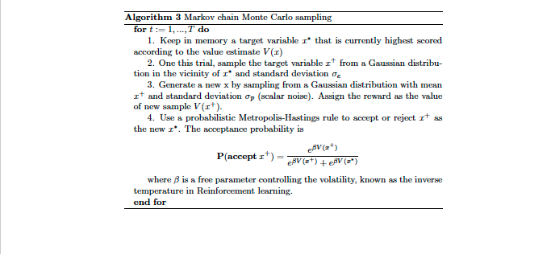

##  Reward Sensitive Gaussian Process (RSGP)

[Article](https://elifesciences.org/articles/55872)

  

<object data="https://github.com/wangjing0/RSGP/blob/master/Algo.pdf" type="application/pdf" width="700px" height="700px">
    <embed src="https://github.com/wangjing0/RSGP/blob/master/Algo.pdf">
        
This browser does not support PDFs. Please download the PDF to view it: <a href="https://github.com/wangjing0/RSGP/blob/master/Algo.pdf">Download PDF</a>.

    </embed>
</object>

### Algorithm for RSGP

  

### Algorithm for Gradient search

  

### Algorithm for MCMC

  

## Code and Auxiliary Functions
  1) simulate data from the model 
  2) feed the data back to recover model parameters 

  	RSGPsim.m

Reward sensitive covariance matrix

  	covSEisoRew.m
    covScaleRew.m

## References
Gaussian process for machine learning (GPML) toolkit

http://www.gaussianprocess.org/gpml

ShadedErrorBar

https://github.com/raacampbell/shadedErrorBar
